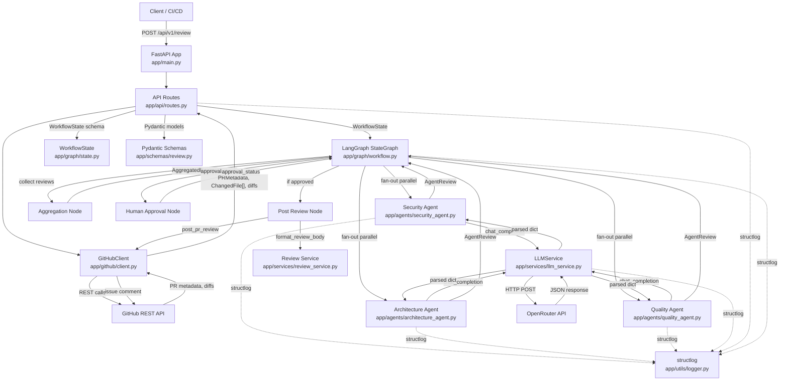
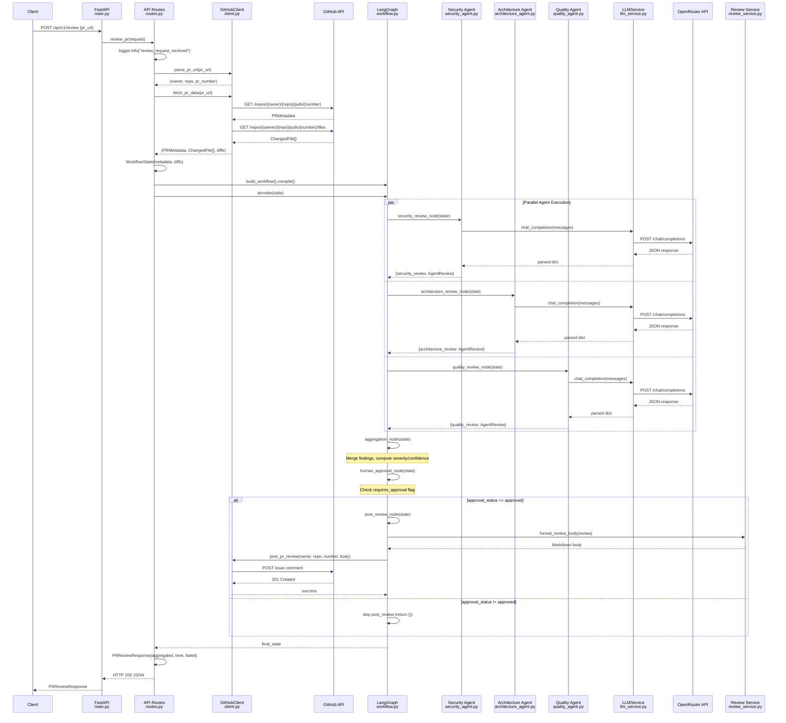
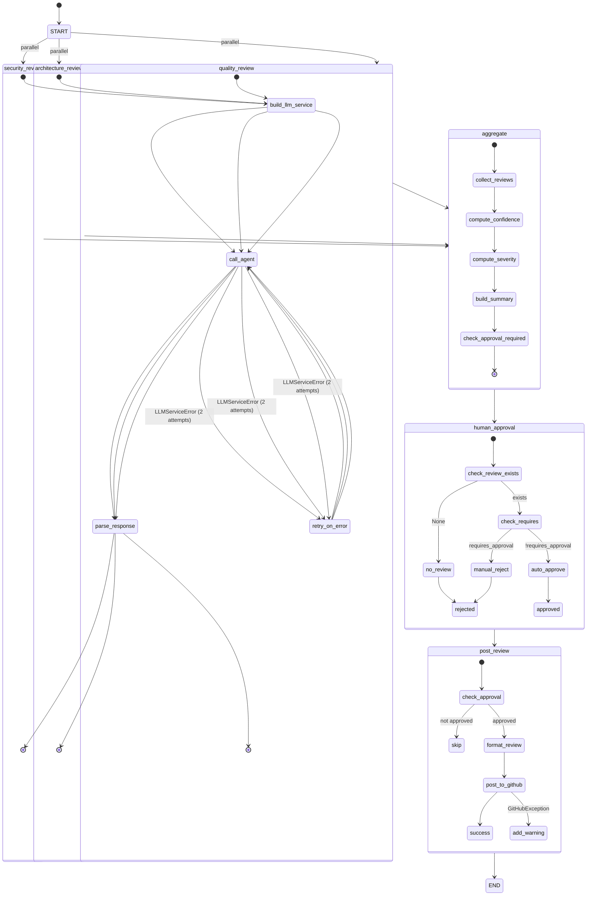
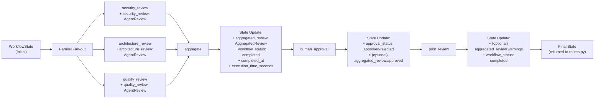
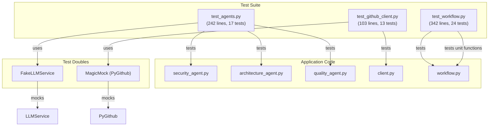
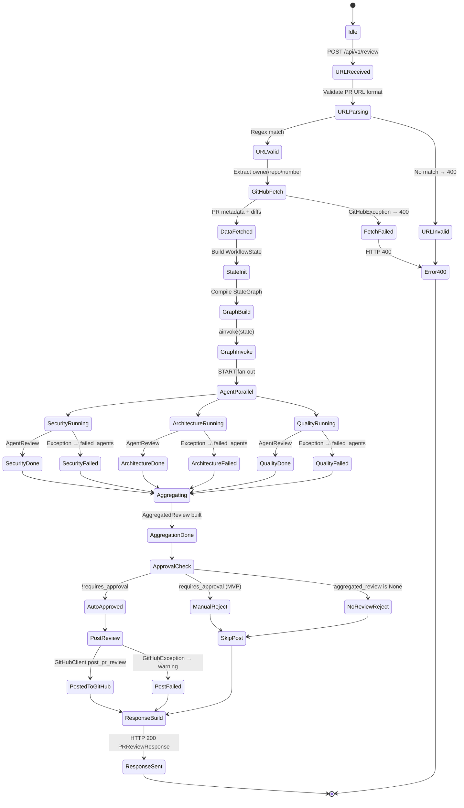
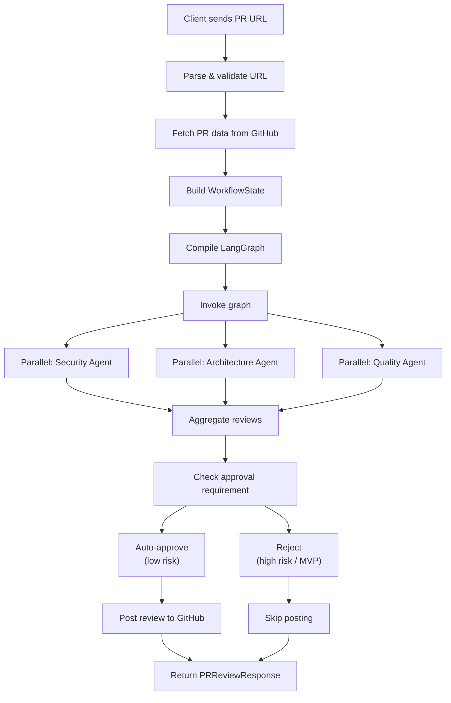
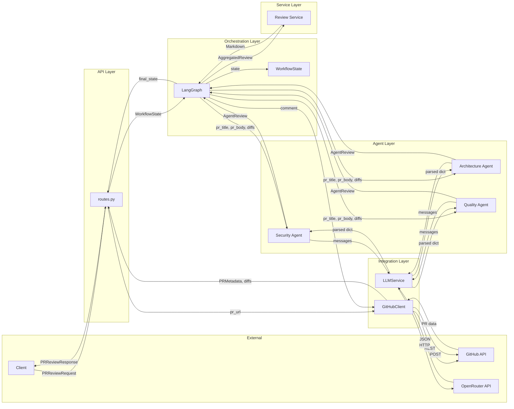
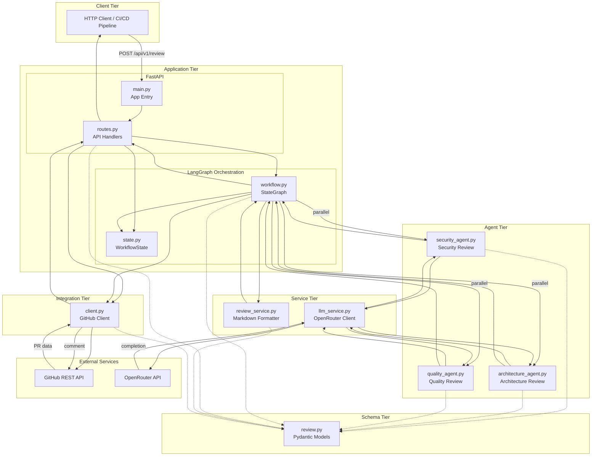

# Multi-Agent PR Reviewer — Complete Architecture & Execution Flow Context Dump

> Optimized for AI visual diagram generation and system architecture rendering.

---

## 1. HIGH-LEVEL ARCHITECTURE EXPLANATION

### 1.1 Overall Project Purpose

**Multi-Agent PR Reviewer** is an AI-assisted engineering workflow automation system that performs automated, multi-specialist code reviews on GitHub Pull Requests. It accepts a GitHub PR URL, fetches the PR metadata and code diffs via the GitHub API, runs three parallel AI specialist agents (Security, Architecture, Quality) against the diffs using an LLM via OpenRouter, aggregates the results into a unified review, applies an approval gate based on severity thresholds, and optionally posts the formatted review back to the PR as a comment.

### 1.2 Core Design Principles

- **Multi-agent parallelism**: Three independent specialist agents review the same PR concurrently via LangGraph's parallel fan-out execution model
- **Graceful degradation**: Individual agent failures do not crash the workflow; failed agents are tracked and reported
- **Severity-based gating**: Critical/high findings or agent failures trigger a human-approval gate (currently auto-rejects in MVP)
- **Structured JSON output**: All agents return typed JSON parsed into Pydantic models
- **Retry resilience**: Two-tier retry system — HTTP-level retries in LLMService (3 attempts, 2-10s backoff) and agent-level retries (2 attempts, 1-5s backoff)
- **Structured observability**: Every lifecycle event emits structured JSON logs via structlog

### 1.3 Technology Stack

| Layer | Technology |
|---|---|
| Web Framework | FastAPI + Uvicorn |
| Orchestration | LangGraph (StateGraph) |
| LLM Provider | OpenRouter API (HTTP) |
| LLM Model | `deepseek/deepseek-chat-v3-0324:free` (configurable via `.env`) |
| GitHub Integration | PyGithub (`github` package) |
| Data Validation | Pydantic v2 |
| HTTP Client | httpx (async) |
| Retry Logic | tenacity |
| Logging | structlog (JSON) |
| Testing | pytest + pytest-asyncio |
| Package Manager | uv |
| Python Version | >=3.12 |

---

## 2. END-TO-END WORKFLOW

### 2.1 Complete Request Lifecycle (12 Phases)

```
Phase 1:  HTTP Request          → POST /api/v1/review {pr_url: "..."}
Phase 2:  URL Parsing           → Extract owner, repo, pr_number via regex
Phase 3:  GitHub Data Fetch     → Fetch PR metadata, changed files, diffs
Phase 4:  State Initialization  → Create WorkflowState Pydantic model
Phase 5:  Graph Compilation     → Build and compile LangGraph StateGraph
Phase 6:  Parallel Agent Review → Security + Architecture + Quality (concurrent)
Phase 7:  Aggregation           → Merge findings, compute severity/confidence
Phase 8:  Approval Gate         → Auto-approve (low risk) or reject (high risk)
Phase 9:  GitHub Post           → Post formatted review as PR comment (if approved)
Phase 10: State Finalization    → Set completed_at, execution_time_seconds
Phase 11: Response Assembly     → Build PRReviewResponse Pydantic model
Phase 12: HTTP Response         → Return 200 with AggregatedReview JSON
```

### 2.2 ASCII Architecture Diagram

```
┌─────────────────────────────────────────────────────────────────────────────┐
│                              CLIENT (HTTP)                                  │
│                    POST /api/v1/review {pr_url}                             │
└──────────────────────────────┬──────────────────────────────────────────────┘
                               │
                               ▼
┌─────────────────────────────────────────────────────────────────────────────┐
│                          FastAPI Application                                │
│  app/main.py → app/api/routes.py                                            │
│                                                                             │
│  ┌───────────────────────────────────────────────────────────────────────┐  │
│  │ review_pr()                                                           │  │
│  │                                                                       │  │
│  │  1. GitHubClient.parse_pr_url(pr_url)                                 │  │
│  │  2. GitHubClient.fetch_pr_data(pr_url)                                │  │
│  │       ├── PRMetadata (title, body, sha, branches)                     │  │
│  │       ├── List[ChangedFile] (filename, status, additions, deletions)  │  │
│  │       └── Dict[str, str] diffs (filename → patch text)                │  │
│  │  3. WorkflowState(pr_url, owner, repo, number, title, body, diffs)    │  │
│  │  4. build_workflow().compile()                                        │  │
│  │  5. graph.ainvoke(state) ─────────────────────────────────────────┐   │  │
│  └───────────────────────────────────────────────────────────────────┼───┘  │
└──────────────────────────────────────────────────────────────────────┼──────┘
                                                                       │
                                                                       ▼
┌─────────────────────────────────────────────────────────────────────────────┐
│                         LangGraph StateGraph                                │
│             app/graph/workflow.py + app/graph/state.py                      │
│                                                                             │
│  ┌───────────────────────────────────────────────────────────────────────┐  │
│  │                        START (fan-out)                                │  │
│  │                          │    │    │                                  │  │
│  │              ┌───────────┘    │    └───────────┐                      │  │
│  │              ▼                ▼                ▼                      │  │
│  │  ┌────────────────┐ ┌────────────────┐ ┌────────────────┐             │  │
│  │  │ security_review│ │architecture_rev│ │ quality_review │             │  │
│  │  │ _node (async)  │ │_node (async)   │ │ _node (async)  │             │  │
│  │  │                │ │                │ │                │             │  │
│  │  │ LLMService     │ │ LLMService     │ │ LLMService     │             │  │
│  │  │ → OpenRouter   │ │ → OpenRouter   │ │ → OpenRouter   │             │  │
│  │  │ → AgentReview  │ │ → AgentReview  │ │ → AgentReview  │             │  │
│  │  └───────┬────────┘ └───────┬────────┘ └───────┬────────┘             │  │
│  │          │                  │                  │                      │  │
│  │          └──────────────────┼──────────────────┘                      │  │
│  │                             ▼                                         │  │
│  │                  ┌─────────────────────┐                              │  │
│  │                  │  aggregation_node   │                              │  │
│  │                  │  (sync)             │                              │  │
│  │                  │                     │                              │  │
│  │                  │  → AggregatedReview │                              │  │
│  │                  │  → workflow_status  │                              │  │
│  │                  │  → execution_time   │                              │  │
│  │                  └──────────┬──────────┘                              │  │
│  │                             ▼                                         │  │
│  │                  ┌─────────────────────┐                              │  │
│  │                  │ human_approval_node │                              │  │
│  │                  │ (sync)              │                              │  │
│  │                  │                     │                              │  │
│  │                  │ → approval_status   │                              │  │
│  │                  └──────────┬──────────┘                              │  │
│  │                             ▼                                         │  │
│  │                  ┌─────────────────────┐                              │  │
│  │                  │  post_review_node   │                              │  │
│  │                  │  (sync)             │                              │  │
│  │                  │                     │                              │  │
│  │                  │ → GitHubClient      │                              │  │
│  │                  │   .post_pr_review() │                              │  │
│  │                  └──────────┬──────────┘                              │  │
│  │                             ▼                                         │  │
│  │                           END                                         │  │
│  └───────────────────────────────────────────────────────────────────────┘  │
│                                                                             │
└─────────────────────────────────────────────────────────────────────────────┘
                               │
                               ▼
┌─────────────────────────────────────────────────────────────────────────────┐
│                          Response Assembly                                  │
│                                                                             │
│  PRReviewResponse(                                                          │
│    review=AggregatedReview,                                                 │
│    execution_time_seconds=float,                                            │
│    failed_agents=list[str]                                                  │
│  )                                                                          │
│                                                                             │
│  HTTP 200 OK → JSON body                                                    │
└─────────────────────────────────────────────────────────────────────────────┘
```

### 2.3 Mermaid: High-Level System Architecture



---

## 3. LOW-LEVEL EXECUTION TRACE

### 3.1 Complete Step-by-Step Execution Flow

```
STEP 0:  Server Startup
         └─ app/main.py
            ├─ structlog.configure(processors=[JSONRenderer])
            ├─ app = FastAPI(title="Multi-Agent PR Reviewer")
            ├─ app.include_router(router)  # from app.api.routes
            └─ @app.on_event("startup") → log "application_started"

STEP 1:  HTTP Request Received
         └─ POST /api/v1/review
            Body: {"pr_url": "https://github.com/owner/repo/pull/42"}
         └─ app/api/routes.py:review_pr()
            ├─ logger.info("review_request_received", pr_url=...)
            └─ github_client = GitHubClient()

STEP 2:  URL Parsing
         └─ app/github/client.py:parse_pr_url(pr_url)
            ├─ PR_URL_PATTERN regex match
            ├─ Extract: owner="owner", repo="repo", pr_number=42
            └─ Return: ("owner", "repo", 42)

STEP 3:  GitHub Data Fetch
         └─ app/github/client.py:fetch_pr_data(pr_url)
            ├─ parse_pr_url(pr_url) → ("owner", "repo", 42)
            ├─ fetch_pr_metadata("owner", "repo", 42)
            │  ├─ get_repository("owner", "repo") → Repository
            │  ├─ repo.get_pull(42) → PullRequest
            │  └─ Return: PRMetadata(number=42, title="...", body="...",
            │       state="open", base_branch="main", head_branch="feature",
            │       head_sha="abc123", url="...")
            ├─ fetch_changed_files("owner", "repo", 42)
            │  ├─ get_repository("owner", "repo") → Repository
            │  ├─ repo.get_pull(42).get_files() → Iterator[File]
            │  └─ Return: [ChangedFile(filename="app.py", status="modified",
            │       additions=10, deletions=5, patch="@@ ... @@\n+line")]
            └─ Build: diffs = {"app.py": "@@ ... @@\n+line", ...}
            └─ Return: (PRMetadata, [ChangedFile], {filename: patch})

STEP 4:  State Initialization
         └─ app/api/routes.py
            └─ WorkflowState(
                 pr_url="https://github.com/owner/repo/pull/42",
                 repo_owner="owner",
                 repo_name="repo",
                 pr_number=42,
                 pr_title="Fix login bug",
                 pr_body="This PR fixes...",
                 commit_sha="abc123",
                 changed_files=["app.py", "utils.py"],
                 diffs={"app.py": "...", "utils.py": "..."}
               )

STEP 5:  Graph Compilation
         └─ app/graph/workflow.py:build_workflow()
            ├─ graph = StateGraph(WorkflowState)
            ├─ Add 6 nodes: security_review, architecture_review,
            │  quality_review, aggregate, human_approval, post_review
            ├─ Add edges: START → [security, architecture, quality] (parallel)
            ├─ Add edges: [security, architecture, quality] → aggregate
            ├─ Add edges: aggregate → human_approval → post_review → END
            └─ Return: graph.compile()

STEP 6:  Graph Invocation (ainvoke)
         └─ await graph.ainvoke(state.model_dump())

         ═══════════════════════════════════════════════════════════════
         PARALLEL EXECUTION: Three agents run concurrently
         ═══════════════════════════════════════════════════════════════

         STEP 6a: security_review_node(state)
                  └─ app/graph/workflow.py:security_review_node()
                     ├─ llm = _build_llm_service() → LLMService()
                     │  └─ httpx.AsyncClient(base_url="https://openrouter.ai/api/v1")
                     ├─ run_security_review(llm, pr_title, pr_body, diffs)
                     │  └─ app/agents/security_agent.py
                     │     ├─ @retry(2 attempts, 1-5s backoff on LLMServiceError)
                     │     ├─ messages = [
                     │     │    {"role": "system", "content": SYSTEM_PROMPT},
                     │     │    {"role": "user", "content": build_user_prompt(...)}
                     │     │  ]
                     │     ├─ llm.chat_completion(messages)
                     │     │  └─ app/services/llm_service.py
                     │     │     ├─ @retry(3 attempts, 2-10s backoff on HTTP errors)
                     │     │     ├─ POST /chat/completions to OpenRouter
                     │     │     │  Body: {model, messages, temperature=0.0, max_tokens=4096}
                     │     │     ├─ Parse response JSON
                     │     │     ├─ _parse_json(content) → strip markdown fences, json.loads()
                     │     │     └─ Return: {"summary": "...", "confidence": 0.85,
                     │     │                 "findings": [...]}
                     │     ├─ Build Finding objects from response
                     │     └─ Return: AgentReview(agent_name="security", summary,
                     │              confidence, findings, execution_time)
                     ├─ logger.info("workflow_node_success", node="security_review", ...)
                     └─ Return: {"security_review": AgentReview}
                     └─ finally: await llm.close()

         STEP 6b: architecture_review_node(state)
                  └─ app/graph/workflow.py:architecture_review_node()
                     ├─ llm = _build_llm_service()
                     ├─ run_architecture_review(llm, pr_title, pr_body, diffs)
                     │  └─ app/agents/architecture_agent.py
                     │     ├─ SYSTEM_PROMPT focuses on: coupling, modularity,
                     │     │  scalability, function complexity, separation of concerns
                     │     ├─ Same retry/LLM call pattern as security agent
                     │     └─ Return: AgentReview(agent_name="architecture", ...)
                     └─ Return: {"architecture_review": AgentReview}

         STEP 6c: quality_review_node(state)
                  └─ app/graph/workflow.py:quality_review_node()
                     ├─ llm = _build_llm_service()
                     ├─ run_quality_review(llm, pr_title, pr_body, diffs)
                     │  └─ app/agents/quality_agent.py
                     │     ├─ SYSTEM_PROMPT focuses on: readability, naming,
                     │     │  duplication, error handling, code style
                     │     ├─ Same retry/LLM call pattern as security agent
                     │     └─ Return: AgentReview(agent_name="quality", ...)
                     └─ Return: {"quality_review": AgentReview}

         ═══════════════════════════════════════════════════════════════
         SEQUENTIAL EXECUTION: Aggregation → Approval → Post
         ═══════════════════════════════════════════════════════════════

         STEP 7:  aggregation_node(state)
                  └─ app/graph/workflow.py:aggregation_node()
                     ├─ Collect non-None agent reviews:
                     │  agent_reviews = [security_review, architecture_review, quality_review]
                     ├─ all_findings = [f for r in agent_reviews for f in r.findings]
                     ├─ Compute overall_confidence = avg(r.confidence for r in agent_reviews)
                     ├─ Compute overall_severity = max severity across all_findings
                     │  (critical=4, high=3, medium=2, low=1, info=0)
                     ├─ summary = _build_summary(agent_reviews)
                     │  └─ "**security**: ...\n\n**architecture**: ...\n\n**quality**: ..."
                     ├─ warnings = []
                     │  └─ If failed_agents: warnings.append(f"Failed agents: ...")
                     ├─ requires_approval = _requires_human_approval(findings, failed_agents)
                     │  └─ True if failed_agents non-empty OR any finding is critical/high
                     ├─ aggregated = AggregatedReview(
                     │    pr_url, pr_title, pr_number, summary, overall_confidence,
                     │    overall_severity, findings, agent_reviews, warnings,
                     │    requires_approval
                     │  )
                     │  └─ @field_validator auto-sorts findings by severity
                     ├─ elapsed = (now() - created_at).total_seconds()
                     └─ Return: {
                          "aggregated_review": aggregated,
                          "workflow_status": WorkflowStatus.completed,
                          "completed_at": datetime,
                          "execution_time_seconds": elapsed
                        }

         STEP 8:  human_approval_node(state)
                  └─ app/graph/workflow.py:human_approval_node()
                     ├─ review = state.aggregated_review
                     ├─ If review is None:
                     │  └─ Return: {"approval_status": rejected, "workflow_status": completed}
                     ├─ If NOT review.requires_approval:
                     │  ├─ Auto-approve
                     │  └─ Return: {
                     │       "aggregated_review": AggregatedReview(**{...review, "approved": True}),
                     │       "approval_status": approved,
                     │       "workflow_status": completed
                     │     }
                     └─ If requires_approval is True:
                        └─ Return: {
                             "approval_status": rejected,
                             "workflow_status": completed
                           }

         STEP 9:  post_review_node(state)
                  └─ app/graph/workflow.py:post_review_node()
                     ├─ If approval_status != approved:
                     │  └─ Return: {}  (skip, no state update)
                     ├─ review = state.aggregated_review
                     ├─ client = GitHubClient()
                     ├─ body = format_review_body(review)
                     │  └─ app/services/review_service.py
                     │     ├─ Build Markdown with severity emojis, grouped findings
                     │     └─ Return: "## AI Review Summary\n**Overall Severity**: ..."
                     ├─ client.post_pr_review(owner, repo, pr_number, body)
                     │  └─ repo.get_pull(pr_number).create_issue_comment(body)
                     └─ Return: {"workflow_status": completed}

         STEP 10: Graph Execution Complete
                  └─ result = final_state dict with all accumulated fields

STEP 11: Response Assembly
         └─ app/api/routes.py
            ├─ aggregated = final_state.get("aggregated_review")
            ├─ If not aggregated → HTTP 500
            ├─ response = PRReviewResponse(
            │    review=aggregated,
            │    execution_time_seconds=final_state.get("execution_time_seconds"),
            │    failed_agents=final_state.get("failed_agents", [])
            │  )
            └─ Return: response  (HTTP 200)

STEP 12: HTTP Response
         └─ JSON body:
            {
              "review": {
                "pr_url": "...",
                "pr_title": "...",
                "pr_number": 42,
                "summary": "...",
                "overall_confidence": 0.85,
                "overall_severity": "high",
                "findings": [...],
                "agent_reviews": [...],
                "warnings": [...],
                "approved": true,
                "requires_approval": false
              },
              "execution_time_seconds": 15.42,
              "failed_agents": []
            }
```

### 3.2 Mermaid: Sequence Diagram (Full Request Lifecycle)



---

## 4. COMPONENT DEPENDENCY MAPPING

### 4.1 File-Level Dependency Graph (DAG)

```
app/main.py
  └── app/api/routes.py
       ├── app/github/client.py
       │    └── (external: github/PyGithub, structlog, re, os, dataclasses)
       ├── app/graph/state.py
       │    └── app/schemas/review.py
       │         └── (external: pydantic, enum)
       ├── app/graph/workflow.py
       │    ├── app/agents/security_agent.py
       │    │    ├── app/schemas/review.py
       │    │    └── app/services/llm_service.py
       │    │         └── (external: httpx, tenacity, structlog, json, os, time)
       │    ├── app/agents/architecture_agent.py
       │    │    ├── app/schemas/review.py
       │    │    └── app/services/llm_service.py
       │    ├── app/agents/quality_agent.py
       │    │    ├── app/schemas/review.py
       │    │    └── app/services/llm_service.py
       │    ├── app/github/client.py
       │    ├── app/graph/state.py
       │    ├── app/schemas/review.py
       │    └── app/services/review_service.py
       │         └── app/schemas/review.py
       └── app/schemas/review.py

app/utils/logger.py
  └── (external: structlog, logging, sys)
```

### 4.2 Component Responsibility Matrix

| Component | File | Responsibility | Inputs | Outputs | Dependencies | Downstream Consumers |
|---|---|---|---|---|---|---|
| **FastAPI App** | `app/main.py` | Application entry point, router mounting, lifecycle events, structlog config | None (startup) | FastAPI app instance | `app/api/routes.py` | Uvicorn server |
| **API Routes** | `app/api/routes.py` | HTTP request handling, PR URL validation, GitHub data fetching orchestration, workflow invocation, response assembly | `PRReviewRequest {pr_url}` | `PRReviewResponse {review, execution_time, failed_agents}` | `GitHubClient`, `WorkflowState`, `build_workflow`, `AggregatedReview` | HTTP client |
| **GitHub Client** | `app/github/client.py` | PyGithub wrapper, PR URL parsing, PR metadata fetching, changed file listing, diff extraction, review comment posting | PR URL or (owner, repo, number) | `PRMetadata`, `ChangedFile[]`, `dict[filename, patch]` | PyGithub, structlog | `routes.py`, `workflow.py` |
| **Workflow State** | `app/graph/state.py` | Central state schema for LangGraph graph, tracks all data flowing through workflow | N/A (schema definition) | `WorkflowState` Pydantic model | `AgentReview`, `AggregatedReview` | All workflow nodes |
| **Workflow Graph** | `app/graph/workflow.py` | LangGraph StateGraph construction, 6 node definitions, parallel fan-out orchestration, aggregation logic, approval gating, GitHub posting | `WorkflowState` | Updated `WorkflowState` dict | All 3 agents, `GitHubClient`, `LLMService`, `ReviewService` | `routes.py` |
| **Security Agent** | `app/agents/security_agent.py` | Security-focused code review via LLM, vulnerability detection | `LLMService`, `pr_title`, `pr_body`, `diffs` | `AgentReview` (security findings) | `LLMService`, Pydantic schemas | `workflow.py` (security_review_node) |
| **Architecture Agent** | `app/agents/architecture_agent.py` | Architecture-focused code review via LLM, design pattern analysis | `LLMService`, `pr_title`, `pr_body`, `diffs` | `AgentReview` (architecture findings) | `LLMService`, Pydantic schemas | `workflow.py` (architecture_review_node) |
| **Quality Agent** | `app/agents/quality_agent.py` | Code quality review via LLM, readability/maintainability analysis | `LLMService`, `pr_title`, `pr_body`, `diffs` | `AgentReview` (quality findings) | `LLMService`, Pydantic schemas | `workflow.py` (quality_review_node) |
| **LLM Service** | `app/services/llm_service.py` | Async HTTP client for OpenRouter API, JSON response parsing, retry logic | `messages[]`, optional `response_format` | `dict` (parsed JSON from LLM) | httpx, tenacity, structlog | All 3 agents |
| **Review Service** | `app/services/review_service.py` | Review formatting utilities, Markdown generation, findings grouping | `AggregatedReview` | `str` (Markdown review body) | Pydantic schemas | `workflow.py` (post_review_node) |
| **Schemas** | `app/schemas/review.py` | Pydantic data models, enums, validation, auto-sorting | N/A (schema definition) | `Finding`, `AgentReview`, `AggregatedReview` | pydantic | All components |
| **Logger** | `app/utils/logger.py` | structlog configuration helper (unused in main.py which configures inline) | `log_level`, `json_format` | Configured structlog | structlog, logging | All components (via structlog.get_logger) |

### 4.3 External Dependency Mapping

| External Service | Used By | Purpose | Authentication |
|---|---|---|---|
| **GitHub REST API** | `GitHubClient` (PyGithub) | Fetch PR metadata, file diffs; post review comments | `GITHUB_TOKEN` env var |
| **OpenRouter API** | `LLMService` (httpx) | LLM chat completions for code review | `OPENROUTER_API_KEY` env var |

---

## 5. WORKFLOW NODE MAPPING

### 5.1 LangGraph Node Detail Table

| Node Name | Function | Type | File | Input (from state) | Output (state updates) | External Calls | Retry Logic | Error Handling |
|---|---|---|---|---|---|---|---|---|
| `security_review` | `security_review_node()` | async | `workflow.py:23` | `pr_title`, `pr_body`, `diffs`, `pr_number`, `failed_agents` | `{"security_review": AgentReview}` OR `{"failed_agents": [...]}` | LLMService → OpenRouter | Agent-level: 2 attempts, 1-5s backoff; HTTP-level: 3 attempts, 2-10s backoff | Catches Exception, appends "security" to failed_agents, logs error |
| `architecture_review` | `architecture_review_node()` | async | `workflow.py:53` | `pr_title`, `pr_body`, `diffs`, `pr_number`, `failed_agents` | `{"architecture_review": AgentReview}` OR `{"failed_agents": [...]}` | LLMService → OpenRouter | Same as security | Catches Exception, appends "architecture" to failed_agents, logs error |
| `quality_review` | `quality_review_node()` | async | `workflow.py:83` | `pr_title`, `pr_body`, `diffs`, `pr_number`, `failed_agents` | `{"quality_review": AgentReview}` OR `{"failed_agents": [...]}` | LLMService → OpenRouter | Same as security | Catches Exception, appends "quality" to failed_agents, logs error |
| `aggregate` | `aggregation_node()` | sync | `workflow.py:113` | `security_review`, `architecture_review`, `quality_review`, `failed_agents`, `pr_url`, `pr_title`, `pr_number`, `created_at` | `{"aggregated_review": AggregatedReview, "workflow_status": completed, "completed_at": datetime, "execution_time_seconds": float}` | None | None | N/A (deterministic computation) |
| `human_approval` | `human_approval_node()` | sync | `workflow.py:213` | `aggregated_review`, `pr_number` | `{"approval_status": approved/rejected, "workflow_status": completed}` ± updated `aggregated_review` | None | None | If no review → rejected |
| `post_review` | `post_review_node()` | sync | `workflow.py:255` | `approval_status`, `aggregated_review`, `repo_owner`, `repo_name`, `pr_number` | `{}` (skip) OR `{"workflow_status": completed}` OR `{"aggregated_review": ..., "workflow_status": completed}` (on error) | GitHubClient.post_pr_review() | None | Catches Exception, appends warning to aggregated_review |

### 5.2 Mermaid: Workflow Node State Machine



### 5.3 Edge Topology

```
START ──────────────────────────────────────────────────────────────────────┐
  ├──→ security_review ─────────────────────────────────────────────────────┤
  ├──→ architecture_review ─────────────────────────────────────────────────┤
  ├──→ quality_review ──────────────────────────────────────────────────────┤
  │                                                                          │
  │   security_review ───────────────────────────────────────────────────────┤
  │   architecture_review ───────────────────────────────────────────────────┤
  │   quality_review ────────────────────────────────────────────────────────┤
  └──────────────────────────────────────────────────────────────────────→ aggregate
                                                                              │
                                                                          → human_approval
                                                                              │
                                                                          → post_review
                                                                              │
                                                                          → END
```

---

## 6. STATE PROPAGATION MAPPING

### 6.1 WorkflowState Field Lifecycle

```
Field                     │ Init   │ Security  │ Architecture │ Quality  │ Aggregate │ Approval │ Post
                          │ (routes)│ Node      │ Node         │ Node     │ Node      │ Node     │ Node
──────────────────────────┼────────┼───────────┼──────────────┼──────────┼───────────┼──────────┼───────
pr_url                    │ SET    │ READ      │ READ         │ READ     │ READ      │ READ     │ READ
repo_owner                │ SET    │ READ      │ READ         │ READ     │ READ      │ READ     │ READ
repo_name                 │ SET    │ READ      │ READ         │ READ     │ READ      │ READ     │ READ
pr_number                 │ SET    │ READ      │ READ         │ READ     │ READ      │ READ     │ READ
pr_title                  │ SET    │ READ      │ READ         │ READ     │ READ      │ READ     │ READ
pr_body                   │ SET    │ READ      │ READ         │ READ     │ READ      │ -        │ -
commit_sha                │ SET    │ READ      │ READ         │ READ     │ -         │ -        │ -
changed_files             │ SET    │ READ      │ READ         │ READ     │ -         │ -        │ -
diffs                     │ SET    │ READ      │ READ         │ READ     │ -         │ -        │ -
security_review           │ None   │ SET       │ READ         │ READ     │ READ      │ -        │ -
architecture_review       │ None   │ READ      │ SET          │ READ     │ READ      │ -        │ -
quality_review            │ None   │ READ      │ READ         │ SET      │ READ      │ -        │ -
failed_agents             │ []     │ MAY SET   │ MAY SET      │ MAY SET  │ READ      │ -        │ -
aggregated_review         │ None   │ -         │ -            │ -        │ SET       │ READ/SET │ READ
approval_status           │ pending│ -         │ -            │ -        │ -         │ SET      │ READ
workflow_status           │ pending│ -         │ -            │ -        │ SET       │ SET      │ SET
created_at                │ SET    │ READ      │ READ         │ READ     │ READ      │ -        │ -
completed_at              │ None   │ -         │ -            │ -        │ SET       │ -        │ -
execution_time_seconds    │ None   │ -         │ -            │ -        │ SET       │ -        │ -
```

### 6.2 State Transformation Per Node

```
INPUT STATE (from routes.py):
  WorkflowState {
    pr_url: "https://github.com/owner/repo/pull/42",
    repo_owner: "owner",
    repo_name: "repo",
    pr_number: 42,
    pr_title: "Fix login bug",
    pr_body: "This PR fixes the login...",
    commit_sha: "abc123def",
    changed_files: ["app/auth.py", "app/utils.py"],
    diffs: {"app/auth.py": "@@ -10,5 +10,8 @@\n...", "app/utils.py": "..."},
    security_review: None,
    architecture_review: None,
    quality_review: None,
    failed_agents: [],
    aggregated_review: None,
    approval_status: pending,
    workflow_status: pending,
    created_at: 2026-05-17T10:00:00Z,
    completed_at: None,
    execution_time_seconds: None
  }

AFTER PARALLEL AGENT NODES (state merged by LangGraph):
  {
    security_review: AgentReview(agent_name="security", summary="...", confidence=0.85,
                  findings=[Finding(title="Hardcoded API key", severity="critical", ...)]),
    architecture_review: AgentReview(agent_name="architecture", summary="...", confidence=0.9,
                      findings=[Finding(title="Tight coupling", severity="medium", ...)]),
    quality_review: AgentReview(agent_name="quality", summary="...", confidence=0.75,
                 findings=[Finding(title="Missing error handling", severity="high", ...)]),
    failed_agents: [],  // or ["security"] if that agent failed
    // ... all original fields preserved
  }

AFTER AGGREGATION NODE:
  {
    aggregated_review: AggregatedReview(
      pr_url="...", pr_title="...", pr_number=42,
      summary="**security**: ...\n\n**architecture**: ...\n\n**quality**: ...",
      overall_confidence=0.83,  // avg(0.85, 0.9, 0.75)
      overall_severity="critical",  // max across all findings
      findings=[...all findings sorted by severity...],
      agent_reviews=[security_review, architecture_review, quality_review],
      warnings=[],
      approved=False,
      requires_approval=True  // because critical finding exists
    ),
    workflow_status: "completed",
    completed_at: 2026-05-17T10:00:15Z,
    execution_time_seconds: 15.42
  }

AFTER HUMAN APPROVAL NODE:
  {
    approval_status: "rejected",  // because requires_approval=True
    // aggregated_review unchanged (not auto-approved)
  }

AFTER POST REVIEW NODE:
  {
    // approval_status != approved → returns {} (no state update)
    // If approved: would post to GitHub and return {"workflow_status": "completed"}
  }

FINAL STATE (returned to routes.py):
  All accumulated fields from above transformations
```

### 6.3 Mermaid: State Flow Diagram



---

## 7. CONTEXT PROPAGATION

### 7.1 Data Flow Between Components

```
┌──────────────┐
│   PR URL     │  Input from client
│   (string)   │
└──────┬───────┘
       │
       ▼
┌──────────────────────────────────────────────────────────────────┐
│  GitHubClient.parse_pr_url()                                     │
│  Input: "https://github.com/owner/repo/pull/42"                  │
│  Output: ("owner", "repo", 42)                                   │
└──────┬───────────────────────────────────────────────────────────┘
       │
       ▼
┌──────────────────────────────────────────────────────────────────┐
│  GitHubClient.fetch_pr_data()                                    │
│  Input: pr_url                                                   │
│  Output:                                                         │
│    PRMetadata {number, title, body, state, base_branch,          │
│                head_branch, head_sha, url}                       │
│    ChangedFile[] {filename, status, additions, deletions, patch} │
│    diffs {filename: patch_text}                                  │
└──────┬───────────────────────────────────────────────────────────┘
       │
       ▼
┌──────────────────────────────────────────────────────────────────┐
│  WorkflowState (constructed in routes.py)                        │
│  Maps:                                                           │
│    metadata.title    → state.pr_title                            │
│    metadata.body     → state.pr_body                             │
│    metadata.head_sha → state.commit_sha                          │
│    files[].filename  → state.changed_files                       │
│    {filename: patch} → state.diffs                               │
└──────┬───────────────────────────────────────────────────────────┘
       │
       ▼
┌──────────────────────────────────────────────────────────────────┐
│  LangGraph StateGraph (ainvoke)                                  │
│  State flows through 6 nodes, each reading/writing fields        │
└──────┬───────────────────────────────────────────────────────────┘
       │
       ▼
┌──────────────────────────────────────────────────────────────────┐
│  Agent Nodes (parallel)                                          │
│  Read: state.pr_title, state.pr_body, state.diffs                │
│  Call: LLMService.chat_completion(messages)                      │
│    messages = [                                                  │
│      {"role": "system", "content": SYSTEM_PROMPT},               │
│      {"role": "user", "content": build_user_prompt(title,body,   │
│                    diffs)}                                       │
│    ]                                                             │
│  Write: state.{agent}_review = AgentReview                       │
│  On error: state.failed_agents += [agent_name]                   │
└──────┬───────────────────────────────────────────────────────────┘
       │
       ▼
┌──────────────────────────────────────────────────────────────────┐
│  Aggregation Node                                                │
│  Read: state.{security,architecture,quality}_review              │
│        state.failed_agents, state.created_at                     │
│  Compute: overall_confidence (avg), overall_severity (max)       │
│  Write: state.aggregated_review = AggregatedReview               │
│         state.workflow_status = "completed"                      │
│         state.completed_at = now()                               │
│         state.execution_time_seconds = elapsed                   │
└──────┬───────────────────────────────────────────────────────────┘
       │
       ▼
┌──────────────────────────────────────────────────────────────────┐
│  Human Approval Node                                             │
│  Read: state.aggregated_review.requires_approval                 │
│  Write: state.approval_status = approved/rejected                │
│         (optionally) state.aggregated_review.approved = True     │
└──────┬───────────────────────────────────────────────────────────┘
       │
       ▼
┌──────────────────────────────────────────────────────────────────┐
│  Post Review Node                                                │
│  Read: state.approval_status, state.aggregated_review            │
│        state.repo_owner, state.repo_name, state.pr_number        │
│  Call: format_review_body(review) → Markdown                     │
│  Call: GitHubClient.post_pr_review(owner, repo, number, body)    │
│  Write: (on error) state.aggregated_review.warnings += [...]     │
└──────┬───────────────────────────────────────────────────────────┘
       │
       ▼
┌──────────────────────────────────────────────────────────────────┐
│  PRReviewResponse (constructed in routes.py)                     │
│  Maps:                                                           │
│    final_state.aggregated_review    → response.review            │
│    final_state.execution_time_seconds → response.execution_time  │
│    final_state.failed_agents        → response.failed_agents     │
└───────────────────────────────────────────────────────────────────┘
```

### 7.2 LLM Interaction Flow

```
Agent Node (e.g., security_review_node)
  │
  ├─ 1. _build_llm_service()
  │     └─ LLMService(
  │          api_key=os.environ["OPENROUTER_API_KEY"],
  │          model=os.environ.get("OPENROUTER_MODEL", "anthropic/claude-sonnet-4-20250514"),
  │          temperature=0.0,
  │          max_tokens=4096,
  │          timeout=120.0
  │        )
  │     └─ Creates httpx.AsyncClient with:
  │          base_url="https://openrouter.ai/api/v1"
  │          headers={Authorization: Bearer <key>, Content-Type, HTTP-Referer, X-Title}
  │
  ├─ 2. Agent builds messages:
  │     messages = [
  │       {"role": "system", "content": SYSTEM_PROMPT},  // agent-specific
  │       {"role": "user", "content": build_user_prompt(pr_title, pr_body, diffs)}
  │     ]
  │
  ├─ 3. llm.chat_completion(messages)
  │     └─ @retry(3 attempts, 2-10s exponential backoff)
  │     └─ POST /chat/completions
  │        Body: {
  │          model: "deepseek/deepseek-chat-v3-0324:free",
  │          messages: [...],
  │          temperature: 0.0,
  │          max_tokens: 4096
  │        }
  │     └─ Response: {
  │          choices: [{message: {content: "JSON string"}}],
  │          usage: {prompt_tokens, completion_tokens, total_tokens}
  │        }
  │     └─ _parse_json(content):
  │          Strip ```json fences → json.loads()
  │     └─ Return: dict
  │
  ├─ 4. Agent parses response:
  │     findings = [
  │       Finding(
  │         title=f["title"],
  │         description=f["description"],
  │         severity=Severity(f["severity"]),
  │         category=FindingCategory.{agent_type},
  │         file_path=f.get("file_path"),
  │         line_number=f.get("line_number"),
  │         code_snippet=f.get("code_snippet"),
  │         suggested_fix=f.get("suggested_fix")
  │       )
  │       for f in response.get("findings", [])
  │     ]
  │
  ├─ 5. Return AgentReview:
  │     AgentReview(
  │       agent_name=agent_type,
  │       summary=response["summary"],
  │       confidence=response["confidence"],
  │       findings=findings,
  │       agent_execution_time=elapsed
  │     )
  │
  └─ 6. finally: await llm.close()
```

---

## 8. APPROVAL WORKFLOW

### 8.1 Approval Decision Logic

```
┌─────────────────────────────────────────────────────────────┐
│  _requires_human_approval(findings, failed_agents)          │
│                                                             │
│  IF failed_agents is not empty:                             │
│    → RETURN True (requires approval)                        │
│                                                             │
│  FOR each finding in findings:                              │
│    IF finding.severity in (critical, high):                 │
│      → RETURN True (requires approval)                      │
│                                                             │
│  RETURN False (no approval required)                        │
└─────────────────────────────────────────────────────────────┘

┌─────────────────────────────────────────────────────────────┐
│  human_approval_node(state)                                 │
│                                                             │
│  IF state.aggregated_review is None:                        │
│    → approval_status = rejected                             │
│    → (No review was produced, cannot approve)               │
│                                                             │
│  IF NOT review.requires_approval:                           │
│    → Auto-approve                                           │
│    → aggregated_review.approved = True                      │
│    → approval_status = approved                             │
│                                                             │
│  IF review.requires_approval:                               │
│    → approval_status = rejected                             │
│    → (MVP: auto-rejects; production would wait for human)   │
└─────────────────────────────────────────────────────────────┘

┌─────────────────────────────────────────────────────────────┐
│  post_review_node(state)                                    │
│                                                             │
│  IF approval_status != approved:                            │
│    → Return {} (skip posting)                               │
│                                                             │
│  IF approval_status == approved:                            │
│    → Format review body as Markdown                         │
│    → Post to GitHub PR as issue comment                     │
│    → On success: Return {"workflow_status": completed}      │
│    → On failure: Append warning, Return updated state       │
└─────────────────────────────────────────────────────────────┘
```

### 8.2 Approval Scenarios

| Scenario | Findings | Failed Agents | requires_approval | approval_status | Posted to GitHub? |
|---|---|---|---|---|---|
| Clean PR | None | [] | False | approved | Yes |
| Low-risk findings | info, low only | [] | False | approved | Yes |
| Medium findings | medium only | [] | False | approved | Yes |
| High finding | high | [] | True | rejected | No |
| Critical finding | critical | [] | True | rejected | No |
| Agent failure | Any | ["security"] | True | rejected | No |
| Multiple failures | Any | ["security", "quality"] | True | rejected | No |
| No agents ran | None | ["security", "architecture", "quality"] | True | rejected | No |

---

## 9. AGGREGATION FLOW

### 9.1 Aggregation Algorithm

```
INPUT:
  state.security_review: AgentReview | None
  state.architecture_review: AgentReview | None
  state.quality_review: AgentReview | None
  state.failed_agents: list[str]

STEP 1: Collect Reviews
  agent_reviews = []
  all_findings = []

  if security_review:
    agent_reviews.append(security_review)
    all_findings.extend(security_review.findings)

  if architecture_review:
    agent_reviews.append(architecture_review)
    all_findings.extend(architecture_review.findings)

  if quality_review:
    agent_reviews.append(quality_review)
    all_findings.extend(quality_review.findings)

STEP 2: Compute Overall Confidence
  if no agent_reviews:
    overall_confidence = 0.0
  else:
    overall_confidence = round(
      sum(r.confidence for r in agent_reviews) / len(agent_reviews), 2
    )

STEP 3: Compute Overall Severity
  severity_scores = {critical: 4, high: 3, medium: 2, low: 1, info: 0}
  if all_findings:
    overall_severity = finding with max(severity_scores[severity])
  else:
    overall_severity = info

STEP 4: Build Summary
  summary = "\n\n".join(f"**{r.agent_name}**: {r.summary}" for r in agent_reviews)

STEP 5: Determine Approval Requirement
  requires_approval = (
    failed_agents is not empty OR
    any finding has severity critical or high
  )

STEP 6: Build AggregatedReview
  AggregatedReview(
    pr_url, pr_title, pr_number,
    summary, overall_confidence, overall_severity,
    findings=all_findings,  // auto-sorted by severity via field_validator
    agent_reviews, warnings, requires_approval
  )

STEP 7: Calculate Execution Time
  elapsed = (datetime.now(UTC) - state.created_at).total_seconds()

OUTPUT:
  {
    "aggregated_review": AggregatedReview,
    "workflow_status": "completed",
    "completed_at": datetime,
    "execution_time_seconds": elapsed
  }
```

---

## 10. OBSERVABILITY / LOGGING FLOW

### 10.1 Structured Logging Events

| Event Name | Emitted By | Log Level | Key Fields |
|---|---|---|---|
| `application_started` | `main.py` startup | INFO | - |
| `application_shutdown` | `main.py` shutdown | INFO | - |
| `review_request_received` | `routes.py:review_pr` | INFO | `pr_url` |
| `github_fetch_failed` | `routes.py:review_pr` | ERROR | `pr_url`, `error` |
| `workflow_starting` | `routes.py:review_pr` | INFO | `pr_number`, `file_count` |
| `workflow_execution_failed` | `routes.py:review_pr` | ERROR | `error` |
| `review_completed` | `routes.py:review_pr` | INFO | `pr_number`, `finding_count`, `failed_agents` |
| `workflow_started` | `workflow.py:run_workflow` | INFO | `workflow_id`, `pr_url`, `pr_number`, `repo` |
| `workflow_node_success` | `workflow.py:*_review_node` | INFO | `node`, `pr_number`, `finding_count`, `latency` |
| `workflow_node_failed` | `workflow.py:*_review_node` | ERROR | `node`, `pr_number`, `error`, `error_type` |
| `workflow_aggregation_completed` | `workflow.py:aggregation_node` | INFO | `pr_number`, `completed_agents`, `failed_agents`, `finding_count`, `overall_confidence`, `overall_severity`, `requires_approval`, `elapsed` |
| `human_approval_no_review` | `workflow.py:human_approval_node` | WARNING | `pr_number` |
| `human_approval_auto_approved` | `workflow.py:human_approval_node` | INFO | `pr_number`, `overall_severity`, `overall_confidence` |
| `human_approval_required` | `workflow.py:human_approval_node` | INFO | `pr_number`, `overall_severity`, `finding_count`, `failed_agents` |
| `post_review_skipped` | `workflow.py:post_review_node` | INFO | `pr_number`, `approval_status` |
| `post_review_no_review` | `workflow.py:post_review_node` | WARNING | `pr_number` |
| `github_review_posted` | `workflow.py:post_review_node` | INFO | `pr_number`, `repo`, `overall_severity`, `finding_count` |
| `github_review_post_failed` | `workflow.py:post_review_node` | ERROR | `pr_number`, `repo`, `error`, `error_type` |
| `workflow_completed` | `workflow.py:run_workflow` | INFO | `workflow_id`, `pr_number`, `approval_status`, `overall_severity`, `finding_count`, `failed_agents`, `execution_time` |
| `agent_started` | `*_agent.py` | INFO | `agent`, `file_count` |
| `agent_completed` | `*_agent.py` | INFO | `agent`, `finding_count`, `confidence`, `latency` |
| `llm_request_start` | `llm_service.py` | INFO | `model`, `max_tokens`, `temperature` |
| `llm_request_success` | `llm_service.py` | INFO | `model`, `latency`, `prompt_tokens`, `completion_tokens`, `total_tokens` |
| `llm_request_retry` | `llm_service.py` | WARNING | `attempt_number`, `error_type`, `error` |
| `llm_json_parse_failed` | `llm_service.py` | ERROR | `error`, `content_preview` |
| `fetching_repository` | `client.py` | INFO | `owner`, `repo` |
| `fetch_repository_failed` | `client.py` | ERROR | `owner`, `repo`, `error` |
| `fetching_pr_metadata` | `client.py` | INFO | `owner`, `repo`, `pr_number` |
| `fetch_pr_metadata_failed` | `client.py` | ERROR | `pr_number`, `error` |
| `fetching_changed_files` | `client.py` | INFO | `owner`, `repo`, `pr_number` |
| `fetch_changed_files_failed` | `client.py` | ERROR | `pr_number`, `error` |
| `fetching_pr_diffs` | `client.py` | INFO | `owner`, `repo`, `pr_number` |
| `fetching_full_pr_data` | `client.py` | INFO | `pr_url` |
| `posting_pr_review` | `client.py` | INFO | `owner`, `repo`, `pr_number` |
| `pr_review_posted` | `client.py` | INFO | `pr_number` |
| `post_pr_review_failed` | `client.py` | ERROR | `pr_number`, `error` |

### 10.2 Log Format

```json
{
  "event": "workflow_node_success",
  "node": "security_review",
  "pr_number": 42,
  "finding_count": 3,
  "latency": 8.42,
  "level": "info",
  "timestamp": "2026-05-17T10:00:05.123Z"
}
```

---

## 11. RETRY / ERROR HANDLING

### 11.1 Multi-Layer Retry Architecture

```
┌─────────────────────────────────────────────────────────────────────┐
│  LAYER 1: HTTP Retry (LLMService)                                   │
│  File: app/services/llm_service.py:63                               │
│  Decorator: @retry(                                                 │
│    retry=retry_if_exception_type(                                   │
│      httpx.HTTPStatusError,                                         │
│    httpx.ConnectError,                                              │
│      httpx.TimeoutException                                         │
│    ),                                                               │
│    stop=stop_after_attempt(3),                                      │
│    wait=wait_exponential(multiplier=1, min=2, max=10),              │
│    reraise=True,                                                    │
│    before_sleep=_log_retry_attempt                                  │
│  )                                                                  │
│  Triggers: Network errors, HTTP 5xx, timeouts                       │
│  Backoff: 2s → 4s → 8s (capped at 10s)                             │
│  Max retries: 3 total attempts                                      │
│  On exhaustion: Re-raises original exception                        │
└─────────────────────────────────────────────────────────────────────┘
                              │
                              ▼
┌─────────────────────────────────────────────────────────────────────┐
│  LAYER 2: Agent Retry (Each Agent)                                  │
│  File: app/agents/{security,architecture,quality}_agent.py:61-68    │
│  Decorator: @retry(                                                 │
│    retry=retry_if_exception_type(LLMServiceError),                  │
│    stop=stop_after_attempt(2),                                      │
│    wait=wait_exponential(multiplier=1, min=1, max=5),               │
│    reraise=True                                                     │
│  )                                                                  │
│  Triggers: LLMServiceError (JSON parse failure from LLM response)   │
│  Backoff: 1s → 2s (capped at 5s)                                   │
│  Max retries: 2 total attempts                                      │
│  On exhaustion: Re-raises LLMServiceError                           │
└─────────────────────────────────────────────────────────────────────┘
                              │
                              ▼
┌─────────────────────────────────────────────────────────────────────┐
│  LAYER 3: Node Graceful Degradation (Workflow Nodes)                │
│  File: app/graph/workflow.py:40-48, 70-78, 100-108                  │
│  Pattern: try/except in each review node                            │
│  Triggers: Any Exception after all retries exhausted                │
│  Behavior:                                                          │
│    - Logs error with node name, pr_number, error, error_type        │
│    - Returns {"failed_agents": state.failed_agents + [agent_name]}  │
│    - Does NOT crash the workflow                                    │
│    - LLMService client is always closed in finally block            │
└─────────────────────────────────────────────────────────────────────┘
                              │
                              ▼
┌─────────────────────────────────────────────────────────────────────┐
│  LAYER 4: API Error Handling (Routes)                               │
│  File: app/api/routes.py:48-53, 73-78                               │
│  Triggers: GitHub fetch failure → HTTP 400                          │
│            Workflow execution failure → HTTP 500                    │
│            No aggregated review → HTTP 500                          │
│  Behavior: Raises HTTPException with detail message                 │
└─────────────────────────────────────────────────────────────────────┘
```

### 11.2 Error Propagation Path

```
OpenRouter API timeout
  → httpx.TimeoutException
  → LLMService retry (3 attempts, 2-10s backoff)
  → If all fail: re-raises TimeoutException
  → Agent catches as non-LLMServiceError → no agent retry
  → Agent function raises
  → Workflow node catches Exception
  → Returns {"failed_agents": ["security"]}
  → Workflow continues with remaining agents
  → Aggregation node sees missing review, computes with available reviews
  → Approval node sees failed_agents → requires_approval=True → rejected
  → Post review node skips (not approved)
  → Response includes failed_agents=["security"]
```

```
LLM returns invalid JSON
  → LLMService._parse_json raises LLMServiceError
  → Agent retry (2 attempts, 1-5s backoff)
  → If still invalid: re-raises LLMServiceError
  → Workflow node catches Exception
  → Returns {"failed_agents": ["security"]}
  → Same propagation as above
```

```
GitHub API rate limit
  → GithubException from PyGithub
  → routes.py catches Exception
  → Raises HTTPException(status_code=400, detail="Failed to fetch PR data: ...")
  → Client receives 400 Bad Request
```

---

## 12. TESTING ARCHITECTURE

### 12.1 Test File Structure

```
tests/
├── test_agents.py          (242 lines)  - Agent unit tests
├── test_github_client.py   (103 lines)  - GitHub client tests
└── test_workflow.py        (342 lines)  - Workflow/graph tests
```

### 12.2 Test Coverage Matrix

| Test File | Test Class | Test Methods | What It Tests |
|---|---|---|---|
| `test_agents.py` | `TestBuildUserPrompt` | 5 tests | Prompt formatting with/without diffs, title, body |
| `test_agents.py` | `TestSecurityAgent` | 3 tests | Successful review with findings, no findings, LLM error |
| `test_agents.py` | `TestArchitectureAgent` | 2 tests | Successful review, no findings |
| `test_agents.py` | `TestQualityAgent` | 2 tests | Successful review, no findings |
| `test_agents.py` | `TestMalformedLLMResponses` | 5 tests | Missing summary, missing confidence, invalid severity, empty findings, missing optional fields |
| `test_github_client.py` | `TestPRURLPattern` | 6 tests | Valid URLs (standard, with subdomain), invalid URLs (missing number, wrong domain, malformed) |
| `test_github_client.py` | `TestParsePRURL` | 2 tests | Successful parsing, invalid URL raises ValueError |
| `test_github_client.py` | `TestGetRepository` | 2 tests | Successful repo fetch, GithubException propagation |
| `test_github_client.py` | `TestPostPRReview` | 3 tests | Successful comment post, GitHub error, PR error |
| `test_workflow.py` | `TestRequiresHumanApproval` | 7 tests | Failed agents trigger, critical/high/medium/low/info severity, mixed severity |
| `test_workflow.py` | `TestBuildSummary` | 3 tests | Single review, multiple reviews, empty reviews |
| `test_workflow.py` | `TestAggregationNode` | 6 tests | All agents, no agents, failed agents warnings, critical approval, low risk, execution time |
| `test_workflow.py` | `TestHumanApprovalNode` | 3 tests | Auto approve, reject, no review |
| `test_workflow.py` | `TestPostReviewNode` | 5 tests | Skip when rejected/pending/no review, post when approved, error appends warning |
| `test_workflow.py` | `TestBuildWorkflow` | 3 tests | Graph has all nodes, parallel start edges, ends after post review |

### 12.3 Testing Patterns

```
Mock Strategy:
  - FakeLLMService: Implements chat_completion() returning predefined dicts
  - unittest.mock.MagicMock: Mocks PyGithub objects (Github, Repository, PullRequest)
  - unittest.mock.patch: Patches external calls

Test Data:
  - Predefined JSON responses for LLM (with findings, without findings, malformed)
  - Predefined PR URL patterns (valid, invalid)
  - Predefined WorkflowState instances for workflow node tests

Configuration:
  - pyproject.toml: [tool.pytest.ini_options] asyncio_mode = "auto"
  - Run: pytest tests/
```

### 12.4 Mermaid: Test Architecture



---

## 13. FASTAPI INTERACTION

### 13.1 Application Lifecycle

```
┌──────────────────────────────────────────────────────────────────┐
│  Server Startup (uvicorn app.main:app)                           │
│                                                                  │
│  1. Python imports app/main.py                                   │
│  2. structlog.configure(processors=[JSONRenderer])               │
│  3. app = FastAPI(title="Multi-Agent PR Reviewer", ...)          │
│  4. app.include_router(router)  # prefix="/api/v1"               │
│  5. @app.on_event("startup") fires                               │
│     └─ logger.info("application_started")                        │
│  6. Uvicorn starts listening on configured port                  │
└──────────────────────────────────────────────────────────────────┘

┌──────────────────────────────────────────────────────────────────┐
│  Per-Request Processing                                          │
│                                                                  │
│  1. Client sends POST /api/v1/review                             │
│  2. FastAPI parses request body into PRReviewRequest             │
│  3. Pydantic validates pr_url field                              │
│  4. FastAPI calls review_pr(request)                             │
│  5. Handler executes (GitHub fetch → workflow → response)        │
│  6. FastAPI serializes PRReviewResponse to JSON                  │
│  7. HTTP 200 returned                                            │
│                                                                  │
│  Error paths:                                                    │
│  - 422: Pydantic validation error (invalid request body)         │
│  - 400: GitHub fetch failure (bad URL, repo not found, etc.)     │
│  - 500: Workflow execution failure or no aggregated review       │
└──────────────────────────────────────────────────────────────────┘

┌──────────────────────────────────────────────────────────────────┐
│  Server Shutdown                                                 │
│                                                                  │
│  1. @app.on_event("shutdown") fires                              │
│     └─ logger.info("application_shutdown")                       │
│  2. Uvicorn stops accepting connections                          │
│  3. In-flight requests complete (no graceful drain in MVP)       │
└──────────────────────────────────────────────────────────────────┘
```

### 13.2 API Endpoints

| Method | Path | Handler | Request | Response | Status Codes |
|---|---|---|---|---|---|
| `GET` | `/api/v1/health` | `health_check()` | None | `{"status": "healthy"}` | 200 |
| `POST` | `/api/v1/review` | `review_pr(request)` | `{"pr_url": "https://github.com/..."}` | `PRReviewResponse` | 200, 400, 422, 500 |

### 13.3 Request/Response Schema

```
POST /api/v1/review
Content-Type: application/json

{
  "pr_url": "https://github.com/owner/repo/pull/42"
}

---

HTTP 200 OK
Content-Type: application/json

{
  "review": {
    "pr_url": "https://github.com/owner/repo/pull/42",
    "pr_title": "Fix login bug",
    "pr_number": 42,
    "summary": "**security**: No critical issues found.\n\n**architecture**: ...",
    "overall_confidence": 0.83,
    "overall_severity": "high",
    "findings": [
      {
        "title": "Missing input validation",
        "description": "User input is not validated before processing",
        "severity": "high",
        "category": "security",
        "file_path": "app/auth.py",
        "line_number": 42,
        "code_snippet": "user_input = request.data['username']",
        "suggested_fix": "Add input validation using a schema validator"
      }
    ],
    "agent_reviews": [
      {
        "agent_name": "security",
        "summary": "No critical issues found.",
        "confidence": 0.85,
        "findings": [...],
        "agent_execution_time": 8.42
      }
    ],
    "warnings": [],
    "approved": false,
    "requires_approval": true
  },
  "execution_time_seconds": 15.42,
  "failed_agents": []
}
```

---

## 14. PR REVIEW LIFECYCLE

### 14.1 Complete PR Review State Machine



### 14.2 Mermaid: PR Review Flow (Simplified)



---

## 15. DATA MOVEMENT BETWEEN COMPONENTS

### 15.1 Complete Data Flow Matrix

```
Source Component          → Target Component          → Data Type                          → File
──────────────────────────┼───────────────────────────┼────────────────────────────────────┼────────────────────────
Client                    → routes.py                 → PRReviewRequest {pr_url: str}      → HTTP body
routes.py                 → GitHubClient              → pr_url (str)                       → routes.py:46
GitHubClient              → routes.py                 → (PRMetadata, ChangedFile[], diffs) → routes.py:47
routes.py                 → WorkflowState             → Constructor kwargs                 → routes.py:55-65
routes.py                 → LangGraph                 → WorkflowState.model_dump() (dict)  → routes.py:72
LangGraph                 → security_review_node      → WorkflowState (full)               → workflow.py:23
LangGraph                 → architecture_review_node  → WorkflowState (full)               → workflow.py:53
LangGraph                 → quality_review_node       → WorkflowState (full)               → workflow.py:83
security_review_node      → LLMService                → messages (list[dict])              → security_agent.py:88
architecture_review_node  → LLMService                → messages (list[dict])              → architecture_agent.py:86
quality_review_node       → LLMService                → messages (list[dict])              → quality_agent.py:86
LLMService                → OpenRouter                → POST /chat/completions payload     → llm_service.py:88
OpenRouter                → LLMService                → {choices, usage}                   → llm_service.py:91
LLMService                → Agent function            → dict (parsed JSON)                 → llm_service.py:108
Agent function            → security_review_node      → AgentReview                        → security_agent.py:106
security_review_node      → LangGraph                 → {"security_review": AgentReview}   → workflow.py:39
architecture_review_node  → LangGraph                 → {"architecture_review": AgentReview}→ workflow.py:69
quality_review_node       → LangGraph                 → {"quality_review": AgentReview}    → workflow.py:99
LangGraph                 → aggregation_node          → WorkflowState (with agent reviews) → workflow.py:113
aggregation_node          → LangGraph                 → {aggregated_review, workflow_status, completed_at, execution_time} → workflow.py:187-192
LangGraph                 → human_approval_node       → WorkflowState (with aggregated)    → workflow.py:213
human_approval_node       → LangGraph                 → {approval_status, workflow_status} → workflow.py:233-252
LangGraph                 → post_review_node          → WorkflowState (with approval)      → workflow.py:255
post_review_node          → GitHubClient              → (owner, repo, number, body)        → workflow.py:272
post_review_node          → ReviewService             → AggregatedReview                   → workflow.py:271
ReviewService             → post_review_node          → str (Markdown)                     → review_service.py:51
GitHubClient              → GitHub API                → Issue comment                      → client.py:118
LangGraph                 → routes.py                 → final_state (dict)                 → routes.py:72
routes.py                 → Client                    → PRReviewResponse                   → routes.py:87-91
```

### 15.2 Mermaid: Data Flow Diagram



---

## 16. ASCII ARCHITECTURE DIAGRAMS

### 16.1 Layered Architecture

```
┌─────────────────────────────────────────────────────────────────────────────┐
│                              PRESENTATION LAYER                             │
│                                                                             │
│  ┌───────────────────────────────────────────────────────────────────────┐  │
│  │  FastAPI Application (app/main.py)                                    │  │
│  │  - FastAPI app instance                                               │  │
│  │  - structlog JSON configuration                                       │  │
│  │  - Router inclusion                                                   │  │
│  │  - Startup/shutdown event handlers                                    │  │
│  └───────────────────────────────────────────────────────────────────────┘  │
│                                                                             │
│  ┌───────────────────────────────────────────────────────────────────────┐  │
│  │  API Routes (app/api/routes.py)                                       │  │
│  │  - GET  /api/v1/health                                                │  │
│  │  - POST /api/v1/review                                                │  │
│  │  - PRReviewRequest / PRReviewResponse / ErrorResponse                 │  │
│  │  - GitHub data fetching orchestration                                 │  │
│  │  - Workflow invocation and response assembly                          │  │
│  └───────────────────────────────────────────────────────────────────────┘  │
├─────────────────────────────────────────────────────────────────────────────┤
│                           ORCHESTRATION LAYER                               │
│                                                                             │
│  ┌───────────────────────────────────────────────────────────────────────┐  │
│  │  LangGraph StateGraph (app/graph/workflow.py)                         │  │
│  │                                                                       │  │
│  │  Nodes:                                                               │  │
│  │  ┌──────────────┐ ┌──────────────┐ ┌──────────────┐                   │  │
│  │  │ security_rev │ │ arch_review  │ │ quality_rev  │  ← PARALLEL       │  │
│  │  └──────┬───────┘ └──────┬───────┘ └──────┬───────┘                   │  │
│  │         └───────────────┼──────────────────┘                          │  │
│  │                         ▼                                             │  │
│  │                ┌──────────────────┐                                   │  │
│  │                │   aggregation    │                                   │  │
│  │                └────────┬─────────┘                                   │  │
│  │                         ▼                                             │  │
│  │                ┌──────────────────┐                                   │  │
│  │                │  human_approval  │                                   │  │
│  │                └────────┬─────────┘                                   │  │
│  │                         ▼                                             │  │
│  │                ┌──────────────────┐                                   │  │
│  │                │   post_review    │                                   │  │
│  │                └──────────────────┘                                   │  │
│  └───────────────────────────────────────────────────────────────────────┘  │
│                                                                             │
│  ┌───────────────────────────────────────────────────────────────────────┐  │
│  │  Workflow State (app/graph/state.py)                                  │  │
│  │  - WorkflowState Pydantic model (17 fields)                           │  │
│  │  - ApprovalStatus enum (pending/approved/rejected)                    │  │
│  │  - WorkflowStatus enum (pending/running/completed/failed)             │  │
│  └───────────────────────────────────────────────────────────────────────┘  │
├─────────────────────────────────────────────────────────────────────────────┤
│                              AGENT LAYER                                    │
│                                                                             │
│  ┌──────────────────┐ ┌──────────────────┐ ┌──────────────────┐             │
│  │ Security Agent   │ │ Architecture     │ │ Quality Agent    │             │
│  │ (security_agent) │ │ Agent            │ │ (quality_agent)  │             │
│  │                  │ │ (architecture_   │ │                  │             │
│  │ Focus:           │ │  agent)          │ │ Focus:           │             │
│  │ - Secrets        │ │                  │ │ - Readability    │             │
│  │ - SQL injection  │ │ Focus:           │ │ - Naming         │             │
│  │ - Auth bypass    │ │ - Coupling       │ │ - Duplication    │             │
│  │ - Deserialization│ │ - Modularity     │ │ - Error handling │             │
│  │ - Subprocess     │ │ - Scalability    │ │ - Code style     │             │
│  │ - Path traversal │ │ - Complexity     │ │ - Maintainability│             │
│  │ - Crypto         │ │ - Tech debt      │ │                  │             │
│  │                  │ │                  │ │                  │             │
│  │ Retry: 2 attempts│ │ Retry: 2 attempts│ │ Retry: 2 attempts│             │
│  │ Backoff: 1-5s    │ │ Backoff: 1-5s    │ │ Backoff: 1-5s    │             │
│  └──────────────────┘ └──────────────────┘ └──────────────────┘             │
├─────────────────────────────────────────────────────────────────────────────┤
│                             SERVICE LAYER                                   │
│                                                                             │
│  ┌─────────────────────────────────┐ ┌─────────────────────────────────┐    │
│  │ LLMService                      │ │ ReviewService                   │    │
│  │ (app/services/llm_service.py)   │ │ (app/services/review_service.py)│    │
│  │                                 │ │                                 │    │
│  │ - Async HTTP client (httpx)     │ │ - format_review_body()          │    │
│  │ - OpenRouter API integration    │ │ - _group_findings_by_category() │    │
│  │ - JSON parsing & validation     │ │ - Markdown generation           │    │
│  │ - Retry: 3 attempts, 2-10s      │ │ - Severity emoji mapping        │    │
│  │ - Token usage logging           │ │                                 │    │
│  └─────────────────────────────────┘ └─────────────────────────────────┘    │
├─────────────────────────────────────────────────────────────────────────────┤
│                          INTEGRATION LAYER                                  │
│                                                                             │
│  ┌───────────────────────────────────────────────────────────────────────┐  │
│  │  GitHubClient (app/github/client.py)                                  │  │
│  │                                                                       │  │
│  │  - parse_pr_url() → (owner, repo, number)                             │  │
│  │  - get_repository() → Repository                                      │  │
│  │  - fetch_pr_metadata() → PRMetadata                                   │  │
│  │  - fetch_changed_files() → ChangedFile[]                              │  │
│  │  - fetch_pr_diffs() → {filename: patch}                               │  │
│  │  - fetch_pr_data() → (PRMetadata, ChangedFile[], diffs)               │  │
│  │  - post_pr_review() → issue comment                                   │  │
│  │                                                                       │  │
│  │  Wraps: PyGithub (github package)                                     │  │
│  └───────────────────────────────────────────────────────────────────────┘  │
├─────────────────────────────────────────────────────────────────────────────┤
│                            SCHEMA LAYER                                     │
│                                                                             │
│  ┌───────────────────────────────────────────────────────────────────────┐  │
│  │  Pydantic Models (app/schemas/review.py)                              │  │
│  │                                                                       │  │
│  │  Enums:                                                               │  │
│  │  - Severity: critical, high, medium, low, info                        │  │
│  │  - FindingCategory: security, architecture, quality,                  │  │
│  │                   performance, maintainability                        │  │
│  │                                                                       │  │
│  │  Models:                                                              │  │
│  │  - Finding (8 fields + auto-sort by severity)                         │  │
│  │  - AgentReview (5 fields, confidence 0.0-1.0)                         │  │
│  │  - AggregatedReview (10 fields, auto-sort findings)                   │  │
│  └───────────────────────────────────────────────────────────────────────┘  │
├─────────────────────────────────────────────────────────────────────────────┤
│                           UTILITY LAYER                                     │
│                                                                             │
│  ┌───────────────────────────────────────────────────────────────────────┐  │
│  │  Logger (app/utils/logger.py)                                         │  │
│  │  - configure_logger(log_level, json_format)                           │  │
│  │  - structlog with merge_contextvars, add_log_level, TimeStamper       │  │
│  │  - JSONRenderer or ConsoleRenderer output                             │  │
│  └───────────────────────────────────────────────────────────────────────┘  │
└─────────────────────────────────────────────────────────────────────────────┘
```

### 16.2 Directory Structure with Responsibilities

```
multi-agent-pr-reviewer/
│
├── app/                              # Application package
│   ├── main.py                       # FastAPI app entry, structlog config, lifecycle
│   │
│   ├── api/                          # HTTP API layer
│   │   └── routes.py                 # Route handlers, request/response models, workflow orchestration
│   │
│   ├── agents/                       # AI specialist agents
│   │   ├── security_agent.py         # Security vulnerability detection via LLM
│   │   ├── architecture_agent.py     # Architecture/design pattern analysis via LLM
│   │   └── quality_agent.py          # Code quality/readability analysis via LLM
│   │
│   ├── github/                       # GitHub integration
│   │   └── client.py                 # PyGithub wrapper, PR data fetching, comment posting
│   │
│   ├── graph/                        # LangGraph orchestration
│   │   ├── state.py                  # WorkflowState schema, ApprovalStatus, WorkflowStatus enums
│   │   └── workflow.py               # StateGraph definition, 6 nodes, aggregation, approval, posting
│   │
│   ├── schemas/                      # Pydantic data models
│   │   └── review.py                 # Finding, AgentReview, AggregatedReview, Severity, FindingCategory
│   │
│   ├── services/                     # Business logic services
│   │   ├── llm_service.py            # OpenRouter HTTP client, JSON parsing, retry logic
│   │   └── review_service.py         # Markdown formatting, findings grouping
│   │
│   ├── utils/                        # Utilities
│   │   └── logger.py                 # structlog configuration helper
│   │
│   └── prompts/                      # (empty) Prompt templates directory (reserved)
│
├── tests/                            # Test suite
│   ├── test_agents.py                # Agent unit tests (17 tests)
│   ├── test_github_client.py         # GitHub client tests (13 tests)
│   └── test_workflow.py              # Workflow/graph tests (24 tests)
│
├── docs/                             # Documentation
│   └── system_design_and_learning_guide.md  # 1887-line architecture guide
│
├── .env                              # Environment variables (OPENROUTER_API_KEY, GITHUB_TOKEN, MODEL_NAME)
├── .gitignore                        # Git ignore rules
├── docker-compose.yml                # (empty) Docker compose placeholder
├── pyproject.toml                    # Project config, dependencies, pytest settings
├── requirements.txt                  # Flat dependency list
└── uv.lock                           # UV package manager lockfile
```

---

## 17. MERMAID: COMPLETE SYSTEM OVERVIEW



---

## 18. KEY DESIGN DECISIONS & CONSTRAINTS

### 18.1 Design Decisions

| Decision | Rationale |
|---|---|
| **LangGraph over manual async.gather** | Provides state management, node-level error handling, visual graph definition, and future extensibility (conditional edges, human-in-the-loop) |
| **Parallel agent execution** | Independent agents reviewing the same diffs have no interdependencies; parallel execution minimizes total latency |
| **OpenRouter as LLM gateway** | Provides access to multiple models via single API; `.env` uses free DeepSeek model for cost efficiency |
| **Pydantic for all data models** | Automatic validation, serialization, type safety, and JSON schema generation |
| **structlog for observability** | Structured JSON logging enables log aggregation, filtering, and analysis |
| **tenacity for retries** | Declarative retry decorators with exponential backoff, cleaner than manual retry loops |
| **Graceful agent degradation** | Failed agents don't crash the workflow; results are still produced from available agents |
| **MVP auto-reject on high risk** | Production would implement human-in-the-loop; MVP defaults to safe rejection |

### 18.2 Current Limitations (MVP)

| Limitation | Impact |
|---|---|
| No persistent state | Workflow state is lost after response; no audit trail |
| No human-in-the-loop | Approval node auto-rejects on high risk; no actual human review |
| No diff chunking | Large PRs may exceed LLM context window |
| No caching | Same PR reviewed multiple times re-fetches and re-reviews |
| No webhook support | Must be triggered manually via HTTP POST |
| Single model per agent | All agents use the same LLM model; no model specialization |
| No streaming | Response is returned only after full workflow completion |
| No rate limiting | No protection against abuse of the API endpoint |

---

## 19. ENVIRONMENT VARIABLES

| Variable | Required | Default | Used By |
|---|---|---|---|
| `OPENROUTER_API_KEY` | Yes | - | `LLMService` |
| `GITHUB_TOKEN` | Yes | - | `GitHubClient` |
| `MODEL_NAME` | No | `anthropic/claude-sonnet-4-20250514` | `.env` (not directly read by code; would need `OPENROUTER_MODEL`) |
| `OPENROUTER_MODEL` | No | `anthropic/claude-sonnet-4-20250514` | `LLMService` |
| `APP_URL` | No | `http://localhost:8000` | `LLMService` (HTTP-Referer header) |

---

## 20. RUN COMMANDS

```bash
# Install dependencies
uv sync

# Run server
uvicorn app.main:app --reload --port 8000

# Run tests
pytest tests/

# Health check
curl http://localhost:8000/api/v1/health

# Trigger PR review
curl -X POST http://localhost:8000/api/v1/review \
  -H "Content-Type: application/json" \
  -d '{"pr_url": "https://github.com/owner/repo/pull/42"}'
```

---

*End of architecture and execution flow context dump.*
*Generated for AI visual diagram generation and system architecture rendering.*
*Project: Multi-Agent PR Reviewer | Date: 2026-05-17*